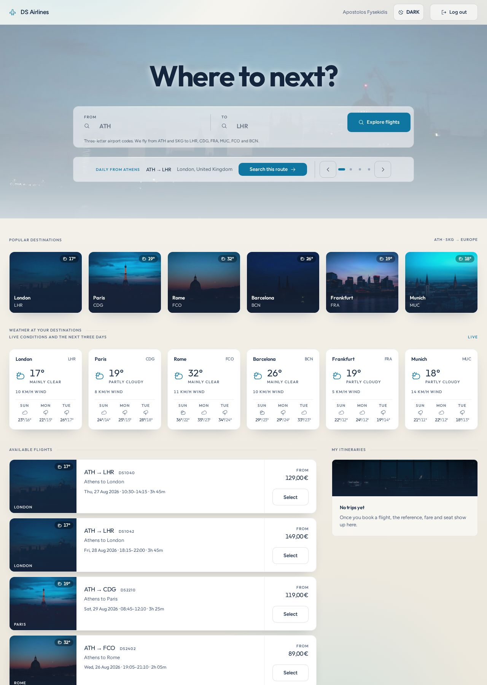
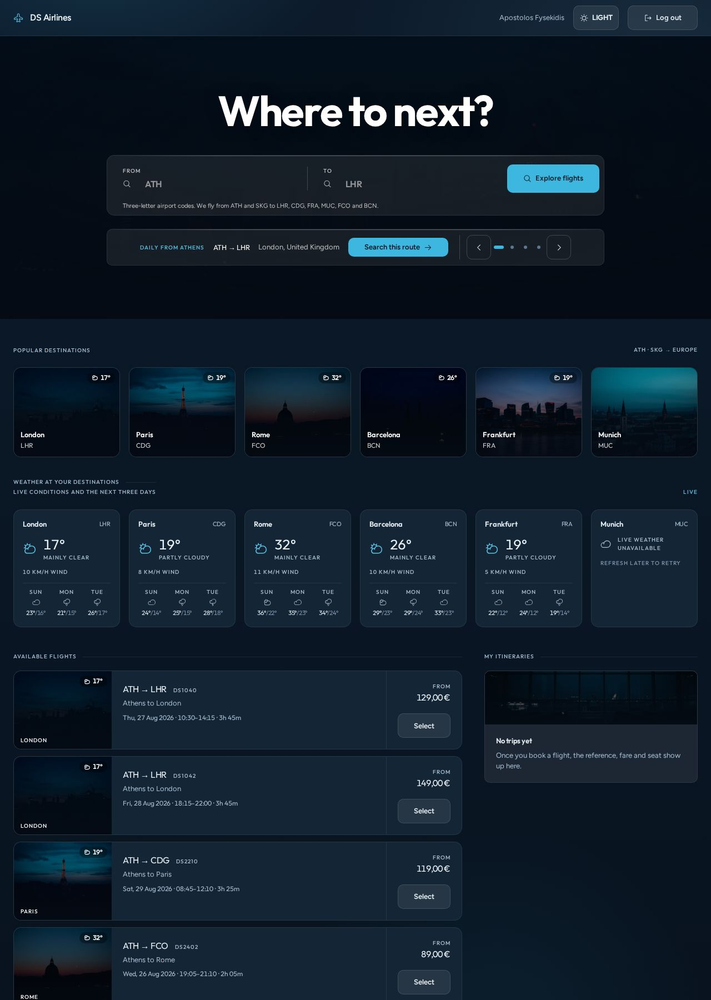
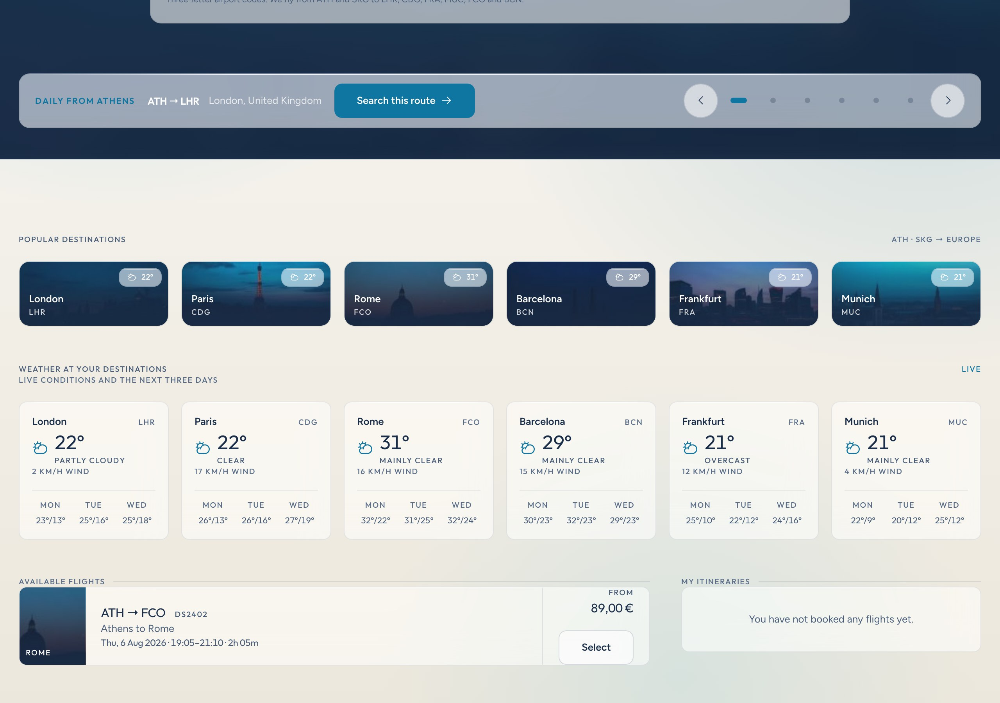
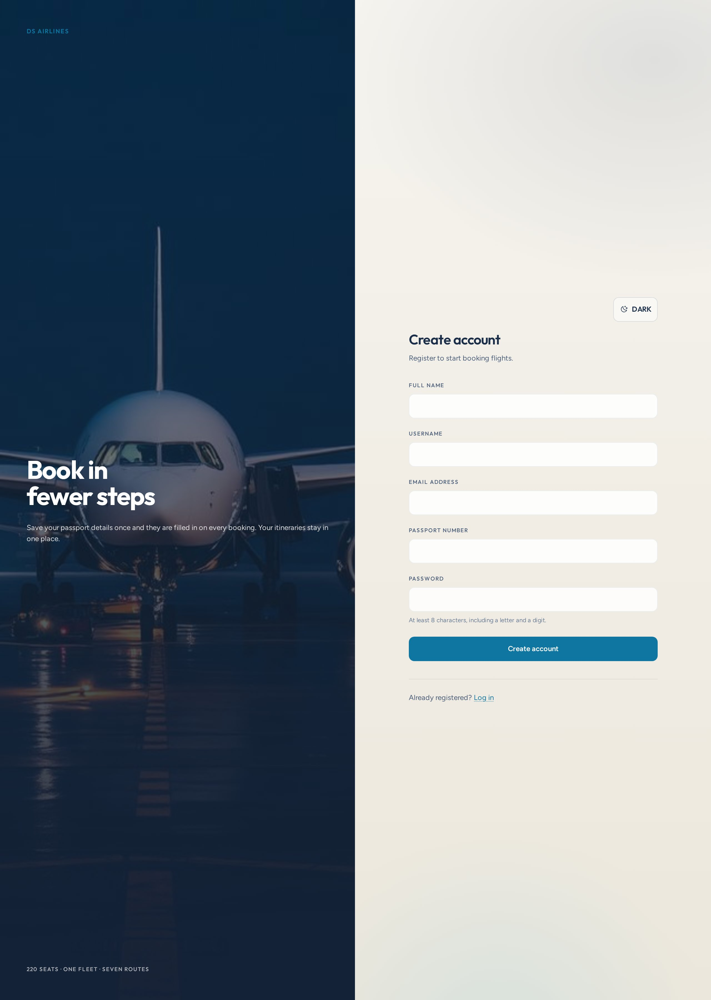
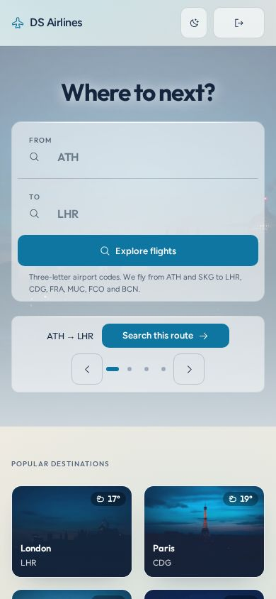
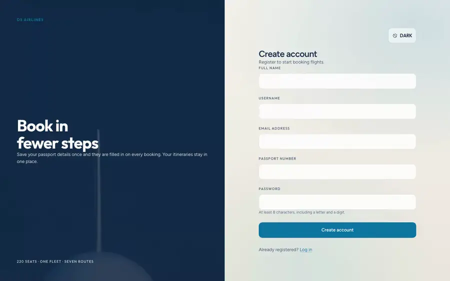

<h1>DS Airlines</h1>

<p>
  <a href="https://github.com/aposfys/ds-airlines-booking/actions/workflows/ci.yml">
    
  </a>
  
  
  
  
</p>

<strong>A university assignment, taken apart and rebuilt as a product.</strong>

DS Airlines started life in the **Department of Digital Systems at the
University of Piraeus** — which is where the DS comes from. It was a Flask
app that could list flights and take a booking, and it did what an assignment
is supposed to do.

This repository is what happened next: a flight booking platform for a
fictional Greek short-haul carrier, built as a business rather than a
codebase. Brand, product analysis, architecture decisions and test strategy
are first-class artefacts here, alongside the API and the interface.

**FastAPI · PostgreSQL · SQLAlchemy 2.0 · Alembic · React 19 · TypeScript ·
Tailwind v4 · Docker**

[**Run it**](#running-it) · [The interface](#the-interface) ·
[What was wrong](#from-assignment-to-product) ·
[What was left out](#what-was-not-built-and-why) · [Tests](#tests) ·
[Documentation](docs/README.md)



---

## From assignment to product

An assignment is finished when it is marked. A product is never asked whether
it is finished — it is asked who flies this airline, what the airline
promises, what happens when a payment fails, and how anyone would know if it
broke.

Answering those questions meant starting with an honest look at what was
already there. The most useful document in this repository is not the API
reference; it is the
[**current-state assessment**](docs/analysis/current-state-assessment.md) — an
audit of the original code recording all 30 defects found, what each would
have cost the business, and where it was resolved.

Four were Critical:

- **The entire admin surface was unreachable.** Tokens never carried the
  `is_admin` claim that every authorisation check read, so flight creation,
  repricing and withdrawal returned 403 to everyone — including the
  administrator the app seeded for itself.
- **Full card numbers were stored in cleartext**, in the same record as the
  passenger's passport number.
- **Every deployment shipped the same known admin password**, hardcoded, next
  to a signing key committed to this repository.
- **`docker-compose up --build` could not build**, because the frontend image
  pinned Node 18 against a toolchain requiring Node 20+.

None of this reflects badly on the original. An assignment is judged on
whether it demonstrates the concept, and it did. What it was never judged on
is whether anyone could run it, sell a seat with it, or trust it with a card
number — and those are the only questions that matter once you call something
a product.

The previous README called it "production-ready". Recording precisely why
that was wrong, rather than quietly rewriting it, is the point of the
exercise — and it is the reason the section on
[what was deliberately not built](#what-was-not-built-and-why) is as long as
the section on what was.

---

## The interface

Built on **[Airy Sky Editorial](docs/design/airy-sky-editorial.md)**, a design
system of my own: light-first, a Paper & Sky palette over cream rather than
white, Outfit for display and numerals, Figtree for the interface. DS Airlines
owns the words; the design system owns everything you can see.

Both themes are token-complete and contrast-verified on every push: **17
colour pairs, checked in light and dark, 34 assertions against WCAG 2.2 AA.**
A hex literal in a component is a bug.

Three of those pairs are new, and they are the ones the design rests on. The
rule is that **no text ever sits on bare photography**, so what CI measures is
the scrim — composited over a blown-out highlight, the worst a photograph can
put underneath it. If the scrims hold there, the rule holds for any image.

| Dashboard — light | Dashboard — dark |
|---|---|
|  |  |

| Search results | Register |
|---|---|
|  |  |

| Mobile — dashboard | Mobile — log in |
|---|---|
|  |  |

**Walkthrough** — creating an account, signing in, moving through the
carousel, the destination cards and the live weather, then running an
ATH → LHR search. It plays by itself.

[](docs/media/usage.webm)

<sup>Animated WebP — 900×562, 24s, 869 KB — so it autoplays and loops inline
with no player and no sound. GitHub strips `autoplay`, `loop` and `muted` from
hand-written `<video>` tags, so an animated image is the only thing that moves
on its own in a README. Click through for the source recording
([`docs/media/usage.webm`](docs/media/usage.webm)), and regenerate both with
`make walkthrough`.</sup>

Every image and frame above is a capture of the running application, taken by
`make screenshots` and `make walkthrough` against a live stack. Those targets
exist because these files were once design comps and a prototype recording
instead: the README described a hero carousel, destination cards and live
weather that the code did not contain, and nothing caught it, because nothing
connected the pictures to the product.

**Live weather** on the destination cards, the flight cards and the dashboard
strip comes from [Open-Meteo](https://open-meteo.com/) — current conditions
plus a three-day forecast, proxied server-side and cached for thirty minutes.
It fails quietly by design: a station the provider does not answer for simply
has no chip. See [ADR-002](docs/adr/0002-server-side-weather-proxy.md).

**On the photography.** The destination and panel images are crops lifted out
of the original design comps, which is the only place they existed. They are
small, already recompressed, and soft at card size — the scrim the design puts
over them anyway hides most of it, but not all. They are honest placeholders
for real licensed photography, and replacing one is a single line in
[`destination-images.ts`](frontend/src/lib/destination-images.ts).

> **No payment is taken and no card details are collected.** The booking form
> has no card field, and the API returns `422` to a request carrying one.
> Do not enter real payment information. See [SECURITY.md](SECURITY.md).

---

## Documentation

| | |
|---|---|
| [Current-state assessment](docs/analysis/current-state-assessment.md) | The full defect register, with business impact and resolution |
| [ADR-001 · PostgreSQL over MongoDB](docs/adr/0001-postgresql-over-mongodb.md) | Why the booking engine left the document model |
| [Personas](docs/product/personas.md) · [User stories](docs/product/user-stories.md) | Who this is for, and a story → endpoint → test traceability matrix |
| [Product brand](docs/brand/brandbook.md) | Positioning, network, fare architecture, voice |
| [Airy Sky Editorial](docs/design/airy-sky-editorial.md) | The design system: palette, type, glass, scrims, photography |
| [Design system README](frontend/src/design-system/README.md) | The token layer as the application loads it |
| [ADR-002 · Server-side weather proxy](docs/adr/0002-server-side-weather-proxy.md) | Why the browser never calls the forecast provider |
| [Test strategy](docs/qa/test-strategy.md) | Layers, how to run everything, and a 42-case manual pass |
| [Changelog](CHANGELOG.md) | What changed in each phase, including what was removed |
| [Security](SECURITY.md) | Why this takes no payments, how to run it safely, and known limitations |

Start at [`docs/`](docs/README.md), which orders these for a first read.

---

## Running it

### Docker — needs nothing else installed

```bash
cp .env.example .env
```

`SECRET_KEY` and `POSTGRES_PASSWORD` are required; the application refuses to
start without them. Generate a key with:

```bash
python -c "import secrets; print(secrets.token_urlsafe(48))"
```

Then:

```bash
make up
```

### Natively

Needs `postgresql@17`, Python 3.13 and Node 22.

```bash
make setup   # venv, npm ci, a database cluster in .pgdata, migrations
make seed    # demo flights and an administrator
make dev     # API on :8000, interface on :5173
```

The cluster lives in `.pgdata` inside the repo on port 55432, so it cannot
collide with any PostgreSQL you already run. `make db-reset` throws it away.

| | |
|---|---|
| Interface | http://localhost:5173 (`make dev`) or http://localhost:3000 (`make up`) |
| API | http://localhost:8000 |
| Swagger UI | http://localhost:8000/docs |

Demo data is opt-in. Nothing is seeded unless you ask, and there are no
default credentials — `make seed` supplies its own, for local use only.

**The administrative surface has no interface.** Publishing flights,
repricing and load factor all run through Swagger — see
[Scope](#what-was-not-built-and-why).

---

## Tests

```bash
make check       # backend + component tests, lint, build, contrast
make check-all   # the above plus end to end
```

| | |
|---|---|
| `make test` | **103** backend tests against real PostgreSQL |
| `make test-frontend` | **69** component tests (Vitest + Testing Library) |
| `make e2e` | **17** end-to-end tests in a real browser (Playwright) |
| `make contrast` | 17 colour pairs × 2 themes, WCAG 2.2 AA |

**189 automated tests**, all in CI, across four jobs.

The backend suite runs against a **real PostgreSQL**, and the fixtures build
the schema by running the Alembic migrations — so every run also proves the
migration chain applies. CI additionally fails on migration drift: a model
changed without a revision to match does not merge.

That matters because of what it replaced. The original six tests all
exercised the same two auth endpoints, since anything touching flights,
bookings or authorisation needed a database they had no way to provide —
which is precisely why a completely dead admin surface sat in the repository
alongside a green suite.

The tests that matter most assert the defects stay fixed:

```
tests/test_authorization.py   an admin gets 200, a passenger gets 403,
                              revoking admin takes effect before expiry
tests/test_bookings.py        payment details are refused outright,
                              cancelling twice cannot credit a seat back
tests/test_flights.py         search does no pattern matching,
                              a flight with bookings cannot be deleted
tests/test_constraints.py     the database itself refuses bad data,
                              and a station cannot exist without a position
tests/test_weather.py         a dead forecast provider still returns 200
e2e/interface.spec.ts         the webfonts actually load
```

The weather tests are worth a word. Every one of them asserts a **200** —
an upstream that returns nothing, an upstream that raises, and a station
outside the network must each leave the dashboard rendering. None of them
touch Open-Meteo: a suite that reached a third party could go red because
someone else was having a bad afternoon, which is the same mistake in the
tests that the proxy exists to avoid in the product.

The font test exists because the fonts once did not load. Nested under Tailwind's
`@import`, the production build shipped **zero** `.woff2` files and the whole
typographic identity fell back to Helvetica **with no error of any kind**.
Four Phase 1 defects were invisible to a green unit suite; the end-to-end
suite is the answer to that.

---

## Scope

**Two phases, delivered.** The project is complete as scoped and stops here
deliberately.

| Phase | Scope | |
|---|---|---|
| **0 · Foundation** | Defect register, critical fixes, CI, repo hygiene | [`v0.1.0`](https://github.com/aposfys/ds-airlines-booking/releases/tag/v0.1.0) |
| **1 · Domain** | PostgreSQL, routes and schedules, fare classes, seat maps, a design system, three test suites | [`v0.2.0`](https://github.com/aposfys/ds-airlines-booking/releases/tag/v0.2.0) |
| **2 · Interface** | Airy Sky Editorial, hero carousel, destination cards, live weather, coordinates on stations | unreleased |

The design system has been replaced twice. v0.2.0 shipped on AF; Atlas
replaced it; Airy Sky Editorial replaced Atlas and is what the product runs on
now. Each swap left the domain, the API and test behaviour alone — the
[changelog](CHANGELOG.md) has what moved and what it recovered.

### What was not built, and why

An earlier plan ran to five phases: seat selection in the interface, payment
capture, an operations interface, a published brand site. They were dropped
on purpose, and the reasoning is worth stating because the omissions are
visible in the product.

What this repository argues is about **judgement** — auditing inherited code
and finding thirty defects in it, choosing a datastore and writing down what
that cost, and building tests that catch what a green suite cannot see. A
seat picker and a payment integration would demonstrate *craft*, which is not
what is in question, and would take considerably longer than what they add.

So the gaps stay, and they are named wherever they bite:

- **The administrative surface has no interface.** Publishing flights,
  repricing and load factor run through Swagger. This is the largest gap
  between what the product does and what a person could use, and it has its
  own empty row in the
  [traceability matrix](docs/product/user-stories.md#traceability).
- **No seat map.** A seat is requested by typing its number, though the
  database already knows which are window, aisle and exit row.
- **No payment capture**, by design — see [SECURITY.md](SECURITY.md).
- **Cancellation ignores refund rules.** Light is non-refundable in data and
  in the brand; cancelling it still returns the seat and records nothing
  about money owed.
- **No special-assistance booking.** A genuine passenger need this does not
  meet — an omission, not a decision.
- **The photography is placeholder.** Real licensed images would replace the
  comp crops described [above](#the-interface); nothing else changes.

Versions stay pre-1.0 for the same reason. 1.0.0 would claim the product is
finished, and it is not; it is *scoped*, which is a different thing.

---

## Project layout

```
backend/
  main.py             App factory, CORS, /health
  app/
    config.py         Validated settings; refuses a weak or missing SECRET_KEY
    db.py             Engine and one-session-per-request
    auth.py           JWT issuance, hashing, authorisation dependencies
    models/domain.py  The relational domain — ten tables
    schemas.py        API request and response models
    routers/          auth · flights · bookings · admin · weather
    seed.py           Reference data, demo flights, the bootstrap admin
  migrations/         Alembic revisions
  scripts/seed.py     Explicit seeding, never a startup side effect
  tests/              103 tests against real PostgreSQL
frontend/
  e2e/                Playwright — booking.spec.ts and interface.spec.ts:
                      the journey, fonts, themes, accessibility
  src/
    design-system/    Airy Sky tokens, fonts, accessibility standard
    index.css         Tokens bridged into Tailwind, plus glass and scrims
    api/              Axios client and typed endpoints
    assets/           Destination and panel photography
    components/       BookingDialog · HeroCarousel · DestinationCards
                      WeatherStrip · WeatherChip · ThemeToggle
    context/          AuthContext · ThemeContext
    lib/              Fare/time formatting, the IATA image map, useWeather
    pages/            Login · Register · Dashboard
                      *.test.tsx sit beside what they test
  scripts/            screenshots.mjs — regenerates docs/screenshots
docs/
  adr/                Architecture decisions
  screenshots/        Captures of the running app, via `make screenshots`
  analysis/           Current-state assessment
  brand/              Product brand, contrast check
  design/             Airy Sky Editorial — the design system
  product/            Personas, user stories, traceability
  qa/                 Test strategy and the manual pass
```

---

## Licence

[MIT](LICENSE) · Apostolos Fysekidis

DS Airlines is a fictional carrier created for this project. It is not
affiliated with any real airline or alliance.
